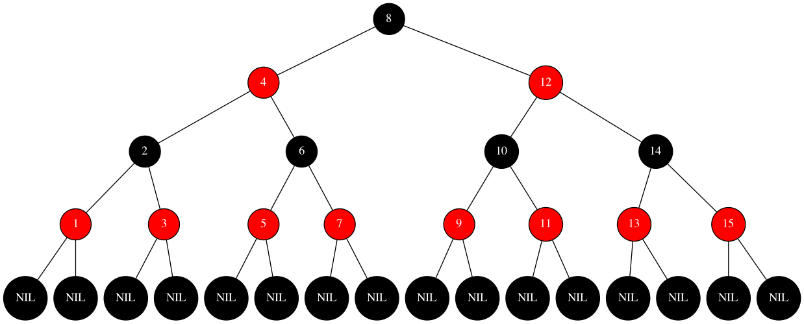
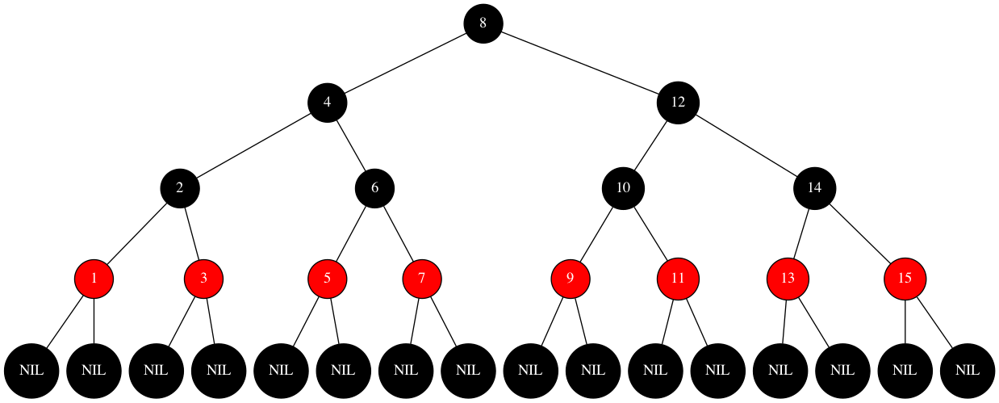
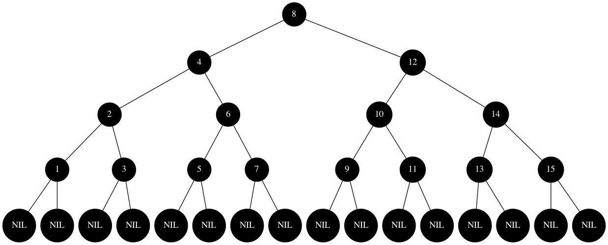

#### 13. 1-1

------

>In the style of Figure 13.1(a), draw the complete binary search tree of height 3 on the keys {1,2,...,15}. Add the NIL leaves and color the nodes in three different ways such that the black-heights of the resulting red-black trees are 2, 3, and 4.

##### Answer

Black Height = 2

Black Height = 3

Black Height = 4

#### 13. 1-2

------

> Draw the red-black tree that results after TREE-INSERT is called on the tree in Figure 13.1 with key 36. If the inserted node is colored red, is the resulting tree a red-black tree? What if it is colored black?

##### Answer

- 插入红色：结点35和36均为红色，违反了 *If a node is red, then both its children are black.*
- 插入黑色：在原有红黑树的基础上加入新的黑色结点会破坏 *For each node, all simple paths from the node to descendant leaves contain the same number of black nodes.*

#### 13. 1-3

------

> Let us define a **relaxed red-black tree** as a binary search tree that satisfies red-black properties 1, 3, 4, and 5. In other words, the root may be either red or black. Consider a relaxed red-black tree T whose root is red. If we color the root of T black but make no other changes to T , is the resulting tree a red-black tree?

##### Answer

- 是，黑高并没有发生变化，同时也满足红黑树的所有规则

#### 13. 1-4

------

> Suppose that we “absorb” every red node in a red-black tree into its black parent, so that the children of the red node become children of the black parent. (Ignore what happens to the keys.) What are the possible degrees of a black node after all its red children are absorbed? What can you say about the depths of the leaves of the resulting tree?

##### Answer - 1

- 子结点均为黑 - 2
- 子结点一红一黑 - 3
- 子结点均为红 - 4

##### Answer - 2

- “absort”操作相当于将所有红色结点抹去，根据红黑树规则 *For each node, all simple paths from the node to descendant leaves contain the same number of black nodes.*，黑高相等可以得出在“absort”操作之后所有叶子结点高度将会相同

#### 13. 1-5

------

> Show that the longest simple path from a node x in a red-black tree to a descendant leaf has length at most twice that of the shortest simple path from node x to a descendant leaf.

##### Answer

1. 定义最长路径为L，最短路径为S。最长路径的黑高为BH(L)，最短路径的黑高为BH(S)
2. 根据红黑树的性质，BH(root) == BH(L) == BH(S)
3. 为了让S尽可能短，我们可以将其全部涂抹为黑色。为了让L尽可能长，我们将其涂抹为红黑相间。则L的红色结点和黑色结点个数相等。假设`S=n`，则`L=n+n=2n`

#### 13. 1-6

------

> What is the largest possible number of internal nodes in a red-black tree with black height k? What is the smallest possible number?

##### Answer

1. 内部结点最多：红黑树最高的情况下，结点红黑相间，树的高度是黑高的2倍为2k，则结点数量为$2^{2k}-1$
2. 内部结点最少：红黑树最低的情况下，结点全黑，树的高度即黑高为k，则结点数量为$2^k-1$

#### 13. 1-7

------

> Describe a red-black tree on n keys that realizes the largest possible ratio of red internal nodes to black internal nodes. What is this ratio? What tree has the smallest possible ratio, and what is the ratio?

##### Answer

1. 比值最大为2 - 根结点为黑色，此时两个子节点为红色。或满足「每个黑色结点的两个子结点都为红色结点」性质的红黑树
2. 比值最小为0 - 只有一个根结点为黑色，或全黑的红黑树

