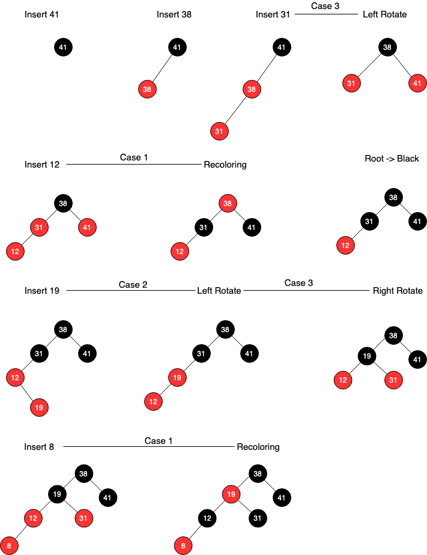
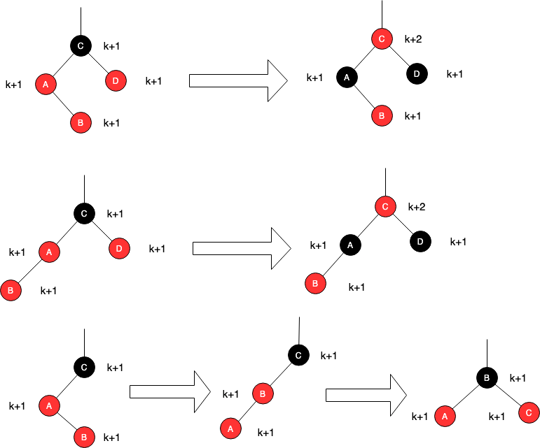

#### 13. 3-1

------

> In line 16 of RB-INSERT, we set the color of the newly inserted node z to red. Notice that if we had chosen to set z's color to black, then property 4 of a red-black tree would not be violated. Why didn't we choose to set z's color to black?

##### Answer

- 如果将z着色为黑色结点，则会破坏“所有结点到其后代叶结点的简单路径上，包含数目相同的黑色结点”的性质。在加入黑色结点z后，无论怎么调整，总会有一条路径比其他路径多一个黑色结点

#### 13. 3-2

------

> Show the red-black trees that result after successively inserting the keys 41, 38, 31, 12, 19, 8 into an initially empty red-black tree.

##### Answer

1. 注意：T.nil是黑色结点，所以在叔结点不存在的情况下，叔结点即T.nil为黑色结点

#### 13. 3-3

------

> Suppose that the black-height of each of the subtrees α, β, γ, δ, ε in Figures 13.5 and 13.6 is k. Label each node in each figure with its black-height to verify that property 5 is preserved by the indicated transformation.

##### Answer

- 注意：黑高并不包括结点自身

#### 13. 3-4

------

> Professor Teach is concerned that RB-INSERT-FIXUP might set color[nil[T]] to RED, in which case the test in line 1 would not cause the loop to terminate when z is the root. Show that the professor's concern is unfounded by arguing that RB-INSERT-FIXUP never sets color[nil[T]] to RED.

##### Answer

- 通过观察`RB-INSERT-FIXUP(T,z)`的伪代码。
  1. 在Case1的情况下，z会将z.p.p染成红色，但题目要求可能会将T.nil染为红色，换言之此种假设下，z.p.p为T.nil，此时z.p为root，但root结点必为黑色，矛盾。综上，Case1并不会将T.nil染为红色。
  2. Case2,3中，z.p.p将会被染为红色，但此时z.p.p已经旋转到原先位置的右孩子节点，而原先位置的结点仍然为黑色。综上，Case2,3也不会将T.nil染为红色

#### 13. 3-5

------

> Consider a red-black tree formed by inserting n nodes with RB-INSERT. Argue that if n > 1, the tree has at least one red node.

##### Answer

- 反证法：假设结点数n > 1时，红黑树没有一个红色结点。则结点数为t = n - 1时，同样也满足该假设，此时结点全部为黑色。在插入第n个结点时，由`RB-INSERT()`函数得新插入的结点是红色结点，在插入后并未破坏红黑树的性质，无需调用`RB-INSERT-FIXUP()`。因为无法调用`RB-INSERT-FIXUP()`，则不会有染色环节。故此时结点数为n的红黑树中有一个红色结点，与前提「假设结点数n > 1时，红黑树没有一个红色结点」矛盾。则该假设错误，题目假设正确。

#### 13. 3-6

------

> Suggest how to implement RB-INSERT efficiently if the representation for red-black trees includes no storage for parent pointers.

##### Answer

1. 可以通过一个HashTable来维护结点之间的关系父子关系
2. 可以通过在Insert时维护一个栈来维护父子关系
   - Case 1 - 两次`pop()`可以分别获得`z.p`和`z.p.p`
   - Case 2 - 两次`pop()`获得`z.p`和`z.p.p`，之后将`z.p.p`和`z`入栈
   - Case 3 - 三次`pop()`分别获得`z.p`，`z.p.p`和`z.p.p.p`，之后将`z.p`入栈